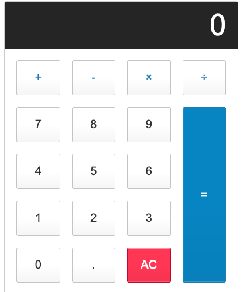

# Calculator App

This is a basic calculator web application built with HTML,CSS and Javascript. The calculator allows users to perform simple arithmetic operations.

## Features

- Addition
- Subtraction
- Multiplication
- Division

## Preview



## Getting Started

### Prerequisites

- A modern web browser

### Installation

1. Clone the repository:

   ```bash
   git clone https://github.com/Tumworobere/JS-Calculator.git

Open index.html in your preferred web browser.
## Usage
- Enter digits by clicking the number buttons.
- Perform arithmetic operations using the operator buttons (+, -, *, /).
- Clear the display using the "All Clear" (AC) button.
- Get the result by clicking the equal sign (=) button.
## Styling
The calculator's styling is defined in the provided CSS file (styles.css). It includes consistent and visually appealing design choices for buttons, screen, and overall layout.

## Author

👤 **Annah Tumworobere **

- GitHub: [@tumworobere](https://github.com/tumworobere)
- Twitter: [@Tannah2090](https://twitter.com/Tannah2090)
- LinkedIn: [LinkedIn](www.linkedin.com/in/annah-tumworobere)

## 🤝 Contributing

Contributions, issues, and feature requests are welcome!

Feel free to check the [issues page](https://github.com/Tumworobere/gitflow/issues).

## Show your support

Give a ⭐️ if you like this project!

## 📝 License

This project is [MIT](./MIT.md) licensed.
